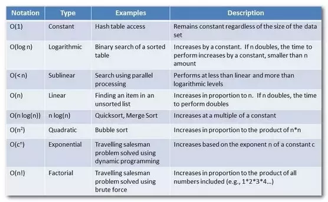

DSA_Roadmap_day_01 

### Understanding Big O Notation (Time and Space Complexity) 
One can hardly become a competent computer scientist or software engineer without developing some significant understanding of data structures and algorithms. It's been said that "algorithms + data structures = programs" and it simply means that computer programs are built from a combination of algorithms and data structures. There's even a book by the same name to back it up.  
So to master how to develop efficient [**use resources optimally**] and effective [**produce expected/correct results**] computer programs, you must invest some time in practically studying your dsa.  

Big shout out to [Ashish Gupta](https://bit.ly/3TEDjBt) for this wonderful DSA curriculum [# 1. in Resources 👇]. 

To establish some context, let us first define a few terms: 

An ***Algorithm*** is a finite, systematic set of instructions executed in a specified order to arrive at a desired result.
A ***Data Structure*** is a well crafted construct or container for storing, retrieving, organizing, and processing data. 
***Time Complexity*** is the duration taken by an algorithm to execute all its instructions.
***Space Complexity*** measures the amount of memory (auxiliary space + input space) consumed by an algorithm to execute. 

***The Big O Notation***
This is a method for analysing the cost of an algorithm. Please refer to the article in #2 of Resources 👇 below to explore the Big O Notation in-depth. When determining the tradeoffs to consider in algorithm design, always give more priority to time complexity over the space complexity of the algorithm when thinking about optimization.   

The image below addresses the big scalability question; ***How will an algorithm perform as the size of its input(s) increases?***

-- <small>Algorithm categories from worst to best.</small>
Image credits: [Big-O Cheat Sheet](https://bit.ly/2KacZxD)

From the Big-O Complexity Chart above, you'll see the key up top that goes from "horrible" to "excellent" and it represents the relevant performance of the algorithms that fall in each of the different categories.

**From the image above, the steeper the slope, the slower the algorithms in that category**. Some categories of classifying algorithms that you are likely to come across are outlined and defined in the following image:

-- <small>Types or categories of algorithms ranked by speed [from best to worst].</small>
Image credits: [From a post on Quora](https://bit.ly/3CR7rDK)

While you are here, make sure to research more on these:
* Big-O Notation - worst case asymptotic notation, represents the ceiling of growth for a given function, i.e. the asymptotic upper bound. This is the best stress test for your algorithms to expose them to their worst case scenarios.
* Big Omega (Ω) Notation - best case scenario i.e. asymptotic lower bounds.
* Big Theta (Θ) Notation - average case.

-- <small>Runtime analysis of an algorithm</small>
Image credits: [From a post on Quora](https://bit.ly/3TIjLMO)
 

##### Resources
1. [DSA Roadmap pdf file by Ashish Gupta](https://bit.ly/3CNM9a9)
2. [What is Big O Notation Explained: Space and Time Complexity](https://bit.ly/3B5SRXQ) - freeCodeCamp
3. [Know Thy Complexities](https://bit.ly/2KacZxD) - Big-O Cheat Sheet
4. [Space and Time Complexity in Computer Algorithms](https://bit.ly/3QawNzq) - Towards Data Science
5. [Data Structures](https://bit.ly/3cEnASi) - TechTarget
6. [Detailed DSA Curriculum](https://bit.ly/2VgzeE4) - Programiz

##### Quick Links
1. [GitHub repo](https://bit.ly/3RfUrMf)
2. [Slack channel](https://bit.ly/3AJMuIm)
3. [Geoffrey Siele](https://bit.ly/3wPwrrm)
4. [Ashish Gupta](https://bit.ly/3TEDjBt)
